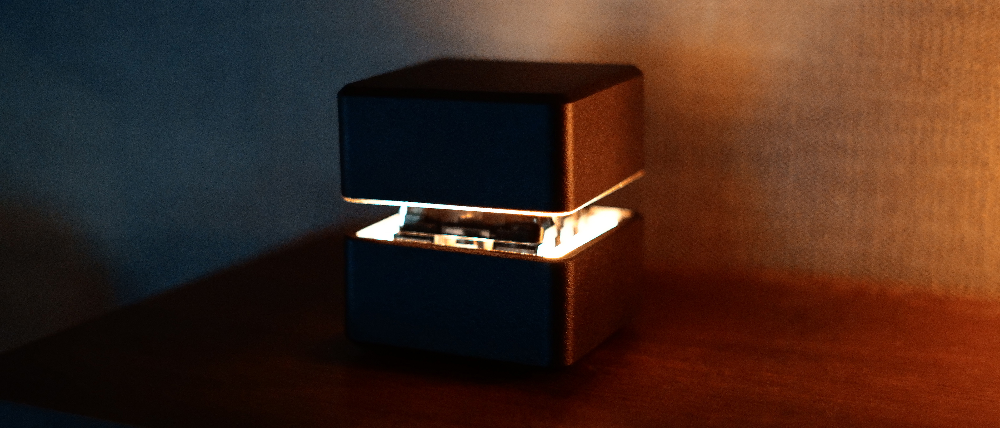
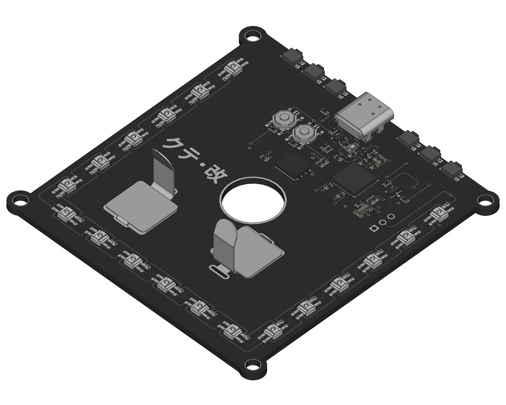
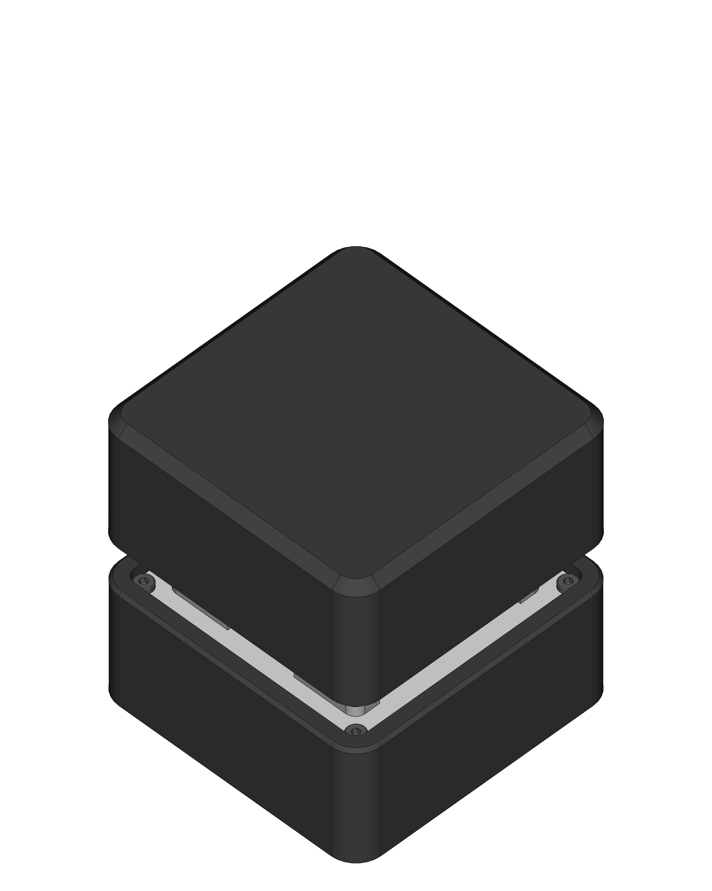

# クテ・改 ビルドガイド

## 目次
- [0. 事前準備](#0-事前準備)
  - [0.1. キットの内容物](#01-キットの内容物)
  - [0.2. キット以外に必要な部品](#02-キット以外に必要な部品)
    - [0.2.1. 3Dプリントケース](#021-3Dプリントケース)
  - [0.3. 必要工具](#03-必要工具)
  - [0.4. アイコンの説明](#04-アイコンの説明)
- [1. 動作確認](#1-動作確認)
- [2. メインPCBの実装](#2-メインPCBの実装--)
  - [2.1. 電池バネの加工](#21-電池バネの加工--)
  - [2.2. 電池バネの実装](#22-電池バネの実装--)
- [3. 組み立て](#3-組み立て---)
  - [3.1. トッププレートとビッグスイッチの取り付け](#31-トッププレートとビッグスイッチの取り付け--)
  - [3.2. メインPCBの取り付け](#32-メインPCBの取り付け--)
  - [3.3. スペーサの取り付け](#33-スペーサの取り付け)
  - [3.4. 3Dプリントケースの取り付け](#34-3Dプリントケースの取り付け)
  - [3.5. ボトムプレートPCBとゴム足の取り付け](#35-ボトムプレートPCBとゴム足の取り付け--)
  - [3.6. 完成](#36-完成)
- [4. ファームウェア](#4-ファームウェア)
  - [4.1. ファームウェアの書き込み方法](#41-ファームウェアの書き込み方法)

---

## 0. 事前準備

### 0.1. キットの内容物

|||
|---|---|

|| 名前 | 数量 | 備考 |
|:---:|---|---:|---|
|1|メインPCB|1||
|2|トッププレート|1|5mm厚アクリル|
|3|ボトムプレートPCB|1||
|4|電池バネ|2|BS-507|
|5|スペーサ|4|M3 15mm(ARB-315E)|
|6|スペーサ|4|M3 13mm(BRB-313SE)|
|7|ネジ|4|M3 8mm FSLC-0308|
|8|ネジ|4|M3 5mm FSLC-0305|
|9|ゴム足|4|TM-166-8|

- ※ 販売形式により内容が異なる場合があります。

---

### 0.2. キット以外に必要な部品

|| 名前 | 数量 | 備考 |
|:---:|---|---:|---|
|1|ビッグスイッチ|1|The Big Switch Series ※1|
|2|USB Type-Cケーブル|1||
|3|3Dプリントケース|1|※2|

- ※1 [The Big Switch Series – NovelKeys LLC](https://novelkeys.com/products/the-big-switch-series)
- ※2 3Dプリントケースはオプションのため必須ではありません。

---

#### 0.2.1. 3Dプリントケース

　オプションで3Dプリントケースを取り付けできます。
BOOTHにて購入時にダウンロードできる3Dプリントデータをご自身で3Dプリントしていただくことができます。
DMM.makeやJLCPCBなどの3Dプリントサービスを利用することで3Dプリンタをお持ちでなくても3Dプリントケースを入手することが可能です。

- [PCB Prototype & PCB Fabrication Manufacturer - JLCPCB](https://jlcpcb.com/)
- [3Dプリンターサービス - DMM.make 3Dプリント](https://make.dmm.com/print/)

---

### 0.3. 必要工具

- 温調ハンダごて
  - HAKKO [FX600](https://www.hakko.com/japan/products/hakko_fx600.html)がオススメです。
- ハンダ
- ペンチ ※1
- ニッパー ※1
- 六角レンチ
  - 対角 1.5mm

- ※1 ビッグスイッチの取付に電池バネを使用する場合のみ必要です。

---

### 0.4. アイコンの説明

|アイコン|説明|
|:---:|---|
||ハンダ付けを必要とします。|
||ネジ留めを必要とします。六角レンチを使用します。|
||	ペンチやニッパーを使用します。|

---

## 1. 動作確認

　まず始めにメインPCBの動作確認を行います。
お使いのPCにメインPCBをUSB Type-Cケーブルで接続して正常に認識されることを確認してください。
認識されない場合はメインPCBの不良、もしくはUSB Type-Cケーブルがデータ通信用ではない可能性があります。

　正常に認識されたらまず、スピーカの動作確認を行います。
初期状態で書き込まれているテストファームウェアでは、USBからの給電による電源投入時にスピーカから音が鳴ります。
もし音が鳴らない場合、初期不良の可能性があります。

　次にLEDの動作確認を行います。
初期状態で書き込まれているテストファームウェアでは、すべてのLEDが赤・緑・青の順に発光を繰り返します。
すべてのLEDが各色で同じ輝度に発光していることが確認できたらLEDの動作確認は完了です。
もし一部のLEDで発光不良が発生している場合、初期不良の可能性があります。

　最後に各スイッチの動作確認を行います。
メインPCB裏面のパッドをピンセットなど導通するものを用いて短絡させてください。
短絡させると`B`と入力されます。
次にUSB端子の横に並んだ6つのタクトスイッチを押してください。
順に`0 1 2 3 4 5`と入力されます。
なお、タクトスイッチは非常にデリケートです。
必要以上に強く押さないようにしてください。

　これらが確認できたらメインPCBの動作確認は完了です。

||
|---|

---

## 2. メインPCBの実装  

　メインPCBに前準備を行います。
メインPCBにビッグスイッチを取り付ける方法は2通りの実装方法があります。
1つ目の実装方法は電池バネ(BS-507)を利用してビッグスイッチをメインPCBに直接ハンダ付けしない方法、2つ目の実装方法はビッグスイッチをメインPCBに直接ハンダ付けする方法です。
ビッグスイッチをメインPCBに直接ハンダ付けする方法を選択する場合は、この手順は省略してください。

|||
|---|---|

---

### 2.1. 電池バネの加工  

　電池バネはそのままではメインPCBに実装できません。
以下の図のとおり、電池バネをペンチとニッパーで加工してください。

||||
|:---:|:---:|:---:|
|1. 初期状態|2. 曲げ加工後|3. 切断後|

---

### 2.2. 電池バネの実装  

　メインPCBに電池バネを実装します。
メインPCBに電池バネをハンダ付けしてください。
電池バネをハンダ付けする場所の周囲には、マイコンが内蔵されたフルカラーのLEDが複数実装されています。
これらのLEDは大変熱に弱いため、ハンダ付けをする際には十分に慎重に行ってください。

　電池バネの実装が完了したら、一度ビッグスイッチを取り付けてみて電池バネがビッグスイッチの足に接触することを確認してください。
接触しない場合は電池バネの角度を調整してください。

|||
|---|---|

---

## 3. 組み立て   

### 3.1. トッププレートとビッグスイッチの取り付け  

　トッププレートにネジとスペーサを取り付けます。
ネジはM3 8mm(FSLC-0308)、スペーサはM3 15mm(ARB-315E)を使用します。
トッププレートに裏表などの向きはありません。
なお、トップレートはアクリル製たのめ、強くネジを締めすぎるとアクリルプレートが破損する可能性があるためご注意ください。
また、後述の工程で3Dプリントケースを取り付ける場合は、完全に固定しないようにしてください。

　トッププレートにネジとスペーサが取り付けできたらビッグスイッチを取り付けます。
ビッグスイッチの前後の爪でトッププレートに固定されていることを確認してください。

||||
|---|---|---|

---

### 3.2. メインPCBの取り付け  

　メインPCBを取り付けます。
ビッグスイッチの足をメインPCBに挿し込み通してください。

　なお、電池バネを使用しない場合はビッグスイッチの足をメインPCBにハンダ付けしてください。
ビッグスイッチをハンダ付けする場所の周囲には、マイコンが内蔵されたフルカラーのLEDが複数実装されています。
これらのLEDは大変熱に弱いため、ハンダ付けをする際には十分に慎重に行ってください。

||||
|---|---|---|

---

### 3.3. スペーサの取り付け

　スペーサを取り付けます。
スペーサはM3 13mm(BRB-313SE)を使用します。
後述の工程で3Dプリントケースを取り付ける場合は、完全に固定しないようにしてください。

|||
|---|---|

---

### 3.4. 3Dプリントケースの取り付け

　3Dプリントケースを取り付けます。
メインPCBのUSB端子の位置を目安に向きを確認してから取り付けてください。

　このとき、前述までの工程でネジやスペーサを完全に固定していると、3Dプリントケースに干渉しスムーズ取り付けが行えないおそれがあります。
万が一3Dプリントケースがスムーズに取り付けられない場合は、一度ネジやスペーサを軽く緩めてから3Dプリントケースの取り付けを行ってください。

|||
|---|---|

---

### 3.5. ボトムプレートPCBとゴム足の取り付け  

　ボトムプレートPCBをネジ留めします。
ネジはM3 5mm(FC-0205)を使用します。
ボトムプレートPCBに裏表などの向きはありません。
ボトムプレートPCBが取り付けできたら、ボトムプレートPCBの四隅にゴム足を貼り付けてください。

||||
|---|---|---|

---

### 3.6. 完成

　最後にキーキャップを取り付け完成です。
書斎のキーボード棚や寝室のベッドサイドに飾りましょう。
そして、必ずその写真を撮影する必要があります。
もちろん言うまでもありませんが、撮影した写真はその後必ずSNSに投稿してください。
この手順を省略することはできません。

|||
|---|---|

---

## 4. ファームウェア

　クテ・改はQuantum Mechanical Keyboard Firmware(以下、QMK)に対応しています。
初期状態で書き込まれているファームウェアは動作確認用のテストファームウェアのため、各スイッチの動作を変更するためにはファームウェアを書き換える必要があります。
使用したいファームウェアファイル(`*.uf2`)をダウンロードしてご利用ください。

#### Remap対応ファームウェア [kute2_remap.uf2](../../uf2/kute2_remap.uf2)
　[Remap](https://remap-keys.app/)に対応したファームウェアです。
Chromeから[Remap](https://remap-keys.app/)のサイトにアクセスすることで各スイッチの動作をChrome上で自由に書き換えることができます。

#### テストファームウェア [kute2_test.uf2](../../uf2/kute2_test.uf2)
　初期状態で書き込まれている動作確認用のファームウェアです。

　もしご自身でビルドを行いたい場合は、以下のリポジトリのブランチをご利用ください。

 - [yynmt/qmk_firmware at kute2](https://github.com/yynmt/qmk_firmware/tree/kute2)

---

### 4.1. ファームウェアの書き込み方法

　ファームウェアを書き込むには、ブートローダーモードでお使いのPCにクテ・改本体をUSB Type-Cケーブルで接続する必要がります。
ブートローダモードで接続するには、まずボトムプレートPCBを取り外し、メインPCB上のRESETボタンとBOOTボタンを操作できるようにします。
ブートローダモードにするには以下の2通りの方法があります。

- A. メインPCB上にあるBOOTボタンを押下した状態でお使いのPCにUSB Type-Cケーブルで接続する
- B. お使いのPCにUSB Type-Cケーブルで接続した状態で、BOOTボタンを押下しながらRESETボタンを押下する

　RESETボタンとBOOTボタンは以下の図を参考にしてください。

||
|---|

　ブートローダモードで接続が完了すると、`RPI-RP2`という名前のUSBドライブとして認識されます。
USBドライブにファームウェアファイル(`*.uf2`)をコピーします。
コピーの方法はお使いのPCのOSによって異なります。
コピーが完了すると自動的にUSBドライブとしての認識が解除され、ブートローダモードが終了します。
これでファームウェアの書き込みは完了です。

---

本ビルドガイドは[Acperience70](http://yynmt.com/kb/a70.html)で書かれました。
